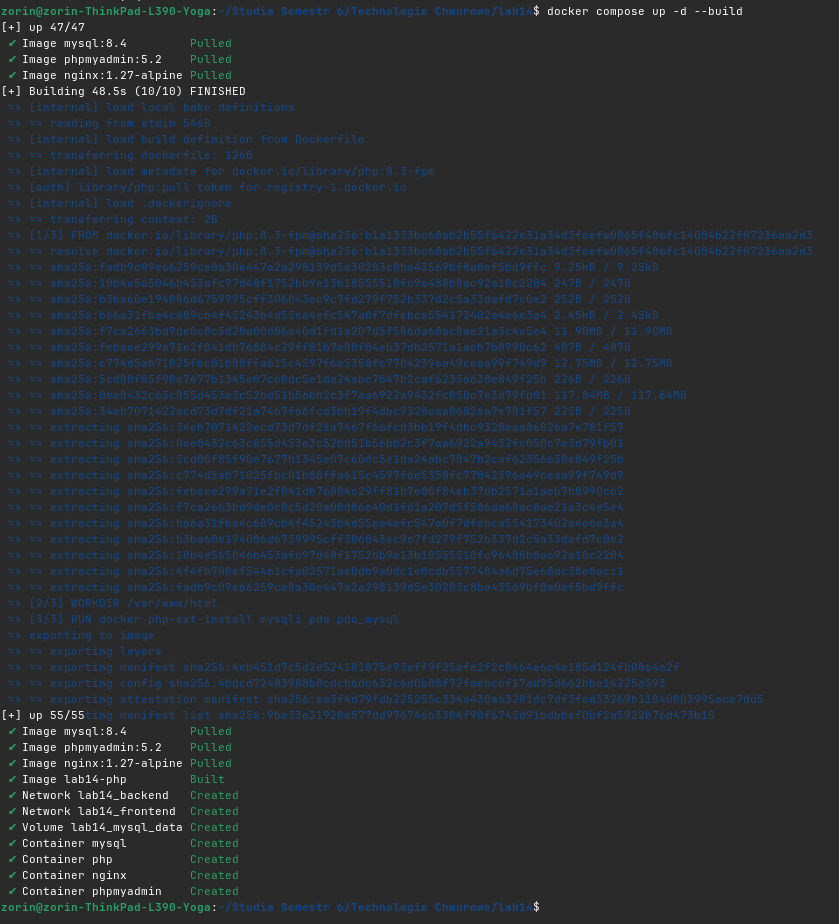
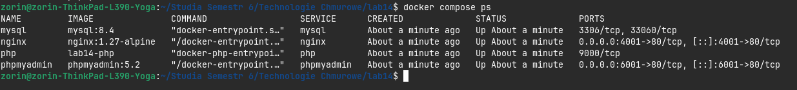
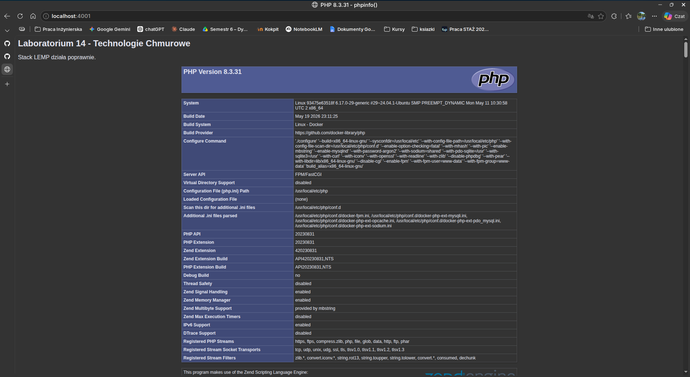
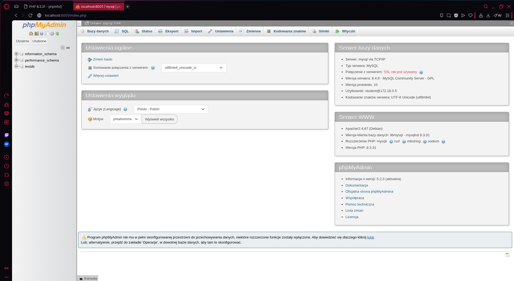
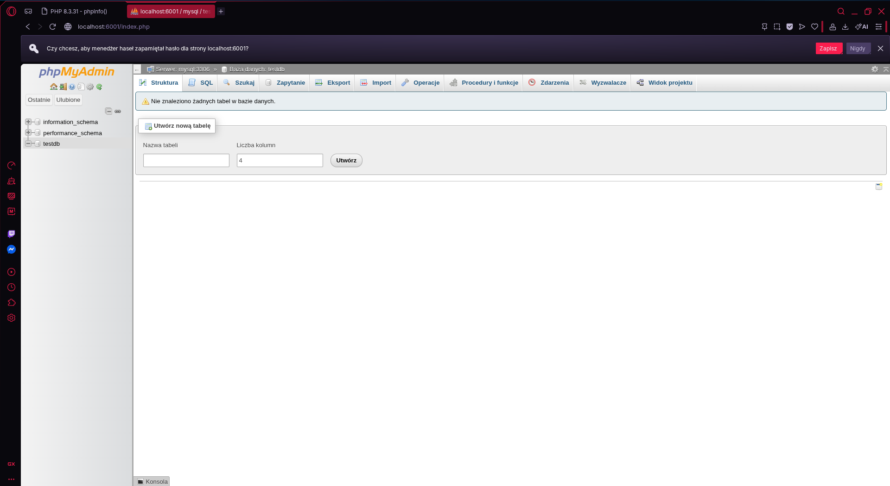

# Laboratorium 14 – Stack LEMP w Docker Compose

**Autor:** Ireneusz Witek

## Cel zadania

Celem zadania było przygotowanie środowiska LEMP (Linux, Nginx, MySQL, PHP) uruchamianego za pomocą Docker Compose oraz udostępnienie narzędzia phpMyAdmin do zarządzania bazą danych.

---

# Wykorzystane kontenery

W rozwiązaniu wykorzystano cztery kontenery:

| Usługa | Obraz |
|----------|----------|
| Nginx | nginx:1.27-alpine |
| PHP-FPM | własny obraz budowany z Dockerfile |
| MySQL | mysql:8.4 |
| phpMyAdmin | phpmyadmin:5.2 |

---

# Konfiguracja sieci

Zostały utworzone dwie sieci Docker:

## frontend

Sieć przeznaczona do komunikacji usług dostępnych dla użytkownika.

Podłączone kontenery:

- nginx

## backend

Sieć przeznaczona do komunikacji pomiędzy usługami aplikacyjnymi.

Podłączone kontenery:

- nginx
- php
- mysql
- phpMyAdmin

---

# Uzasadnienie podłączenia phpMyAdmin do sieci backend

W treści zadania wymagano, aby phpMyAdmin był dostępny na porcie 6001 oraz umożliwiał logowanie do serwera MySQL i tworzenie testowej bazy danych. Aby phpMyAdmin mógł komunikować się z serwerem MySQL, oba kontenery muszą znajdować się w tej samej sieci Docker. 
Z tego powodu phpMyAdmin został podłączony do sieci backend, w której znajduje się również kontener MySQL. 
Dzięki temu phpMyAdmin może korzystać z nazwy hosta: !mysql i nawiązywać połączenie z bazą danych bez konieczności publikowania portu MySQL na zewnątrz. 
Takie rozwiązanie zwiększa bezpieczeństwo środowiska, ponieważ serwer bazy danych nie jest bezpośrednio dostępny z sieci hosta.

---

# Uruchomienie środowiska

Budowa i uruchomienie wszystkich usług:

```bash
docker compose up -d --build
```




Sprawdzenie stanu kontenerów:

```bash
docker compose ps
```



---

# Działanie stosu LEMP

Strona została udostępniona przez serwer Nginx na porcie:

```text
http://localhost:4001
```

Po wejściu na stronę wyświetlana jest aplikacja PHP oraz informacje generowane przez funkcję:

```php
phpinfo();
```

Potwierdza to poprawne działanie:

- Nginx,
- PHP-FPM,
- komunikacji pomiędzy kontenerami.

Screenshot:



---

# Dostęp do phpMyAdmin

phpMyAdmin został udostępniony na porcie:

```text
http://localhost:6001
```

Dane logowania:

```text
Host: mysql
Użytkownik: student
Hasło: student123
```

Po zalogowaniu możliwe jest zarządzanie bazą danych MySQL.

Screenshot:



---

# Inicjalizacja testowej bazy danych

Po zalogowaniu do phpMyAdmin utworzono bazę danych:

```text
testdb
```

Operacja zakończyła się powodzeniem, co potwierdza poprawną współpracę:

- phpMyAdmin,
- MySQL,
- sieci backend.

Screenshot:



---

# Wnioski

Przygotowany stos LEMP działa poprawnie.

Zrealizowano wszystkie wymagania zadania:

- utworzono cztery wymagane kontenery,
- skonfigurowano Docker Compose,
- uruchomiono Nginx,
- uruchomiono PHP-FPM,
- uruchomiono MySQL,
- uruchomiono phpMyAdmin,
- skonfigurowano sieci frontend i backend,
- udostępniono Nginx na porcie 4001,
- udostępniono phpMyAdmin na porcie 6001,
- potwierdzono działanie stosu LEMP,
- potwierdzono możliwość utworzenia testowej bazy danych.
